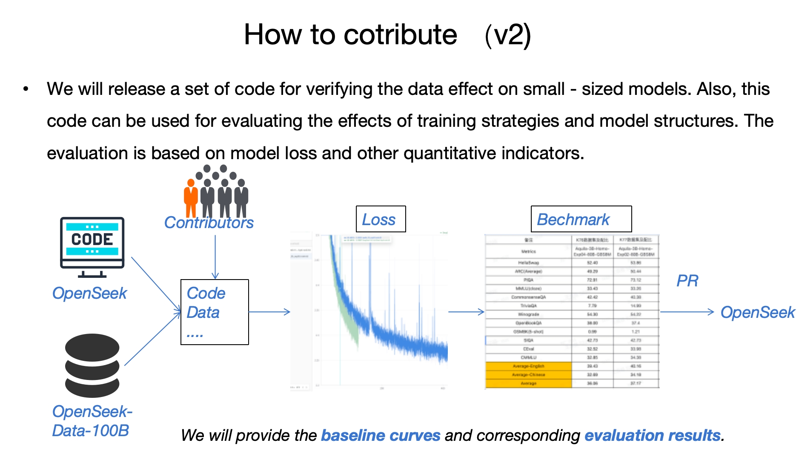

# OpenSeek 贡献指南

感谢您对 OpenSeek 项目感兴趣!本文档将指导您如何为项目做出贡献。

## 贡献方式

您可以通过以下方式为 OpenSeek 做出贡献:

### 1. 提交 Issue
- 报告 bug
- 提出新功能建议
- 提出改进建议

### 2. 提交 Pull Request
- 修复 bug
- 添加新功能
- 改进文档
- 优化性能

## Pull Request 流程

1. Fork 本仓库
2. 创建您的特性分支 (`git checkout -b feature/AmazingFeature`)
3. 提交您的更改 (`git commit -m 'Add some AmazingFeature'`)
4. 推送到分支 (`git push origin feature/AmazingFeature`)
5. 打开一个 Pull Request

## 代码规范

- Python 代码遵循 PEP 8 规范
- 所有代码必须包含适当的注释
- 新功能需要添加相应的单元测试
- 保持代码简洁清晰

## 提交规范
提交信息请遵循以下格式:

- feat: 新功能
- fix: 修复bug
- docs: 文档更新
- style: 代码格式修改
- refactor: 代码重构
- perf: 性能优化
- test: 测试相关
- build: 构建系统或外部依赖项更改
- ci: CI配置和脚本更改
- chore: 其他修改

## 推荐贡献方式

## 我们欢迎以下形式的赞助支持：
- 资金赞助
- 硬件设备捐赠
- 云服务资源赞助

如需了解更多赞助详情，请联系项目维护者。