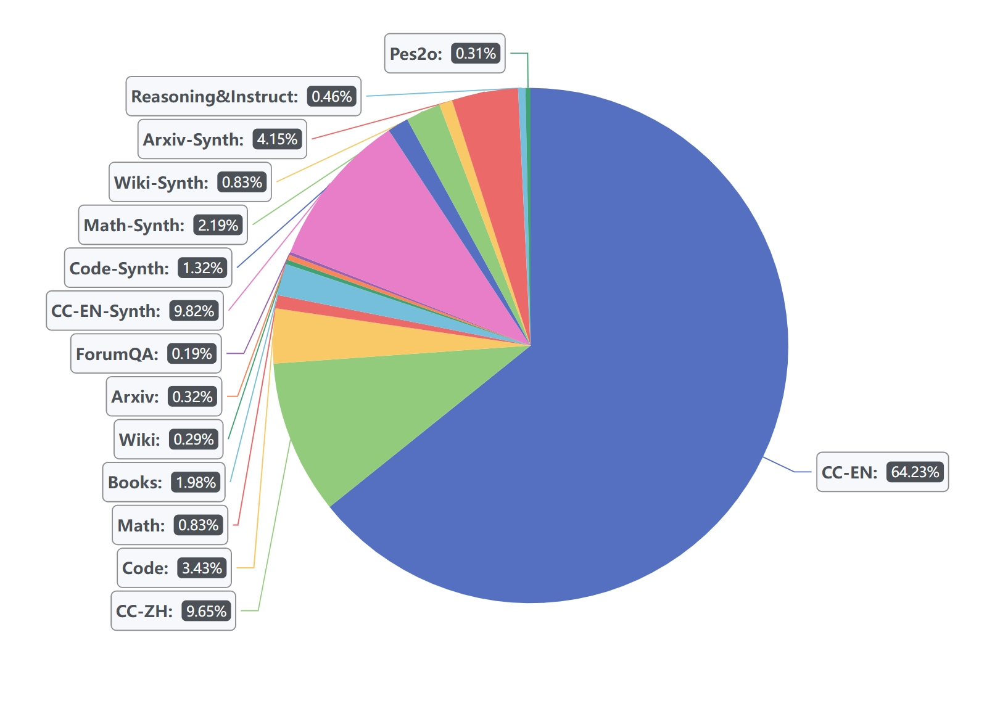

# OpenSeek-Small v1 Model Documentation

## Overview
OpenSeek-Small v1 is the first-stage production model from the OpenSeek project, designed as a foundation for next-generation language models. This document covers key aspects of the model including training data, architecture, and evaluation results.

## Training Data
### Data Composition
- **Total Volume**: 0.72TB of high-quality pretraining data
- **Language Distribution**:
  - Chinese: 10%
  - English: 90%
- **Data Sources**:
  - Webpages (filtered and cleaned)
  - Technical documentation
  - Books and educational materials
  - High-quality synthetic data
- **Sampling Distribution**
  - 

### Data Processing Pipeline
1. Initial filtering for quality and relevance
2. Deduplication at document and paragraph levels
3. Language identification and balancing
4. Special token handling and normalization

## Model Architecture
### Key Specifications
- **Model Size**: 1.4 billion parameters
- **Architecture Type**: Transformer-based
- **Context Window**: 4096 tokens
- **Attention Mechanism**: Multi-head attention with optimizations
- **Positional Encoding**: Rotary Position Embeddings (RoPE)

### Training Configuration
- **Batch Size**: 8M tokens
- **Learning Rate**: 3.0e-3 with cosine decay schedule
- **Optimizer**: AdamW with weight decay
- **Hardware**: Distributed across 64 GPUs

## Evaluation Results
### Benchmark Performance
| Category                        | Metrics (shots)            | OpenSeek-Small-v1 |
|---------------------------------|-----------------------------|--------------------|
| **English - Commonsense Reasoning** | HellaSwag (5-shot)        | 0.3893             |
|                                 | TruthfulQA (0-shot)         | 0.3990             |
|                                 | Winogrande (5-shot)         | 0.5541             |
|                                 | CommonsenseQA (5-shot)      | 0.2048             |
|                                 | PIQA (5-shot)               | 0.7203             |
|                                 | OpenBookQA (5-shot)         | 0.2560             |
|                                 | BoolQ (5-shot)              | 0.6165             |
| **English - Problem Solving**        | ARC Easy (5-shot)          | 0.6237             |
|                                 | ARC Challenge (5-shot)      | 0.3157             |
|                                 | MMLU (5-shot)               | 0.2654             |
| **English - Mathematics**            | GSM8K (5-shot)              | 0.0182             |
|                                 | Minerva Math (4-shot)       | 0.0010             |
| **Chinese**                          | CEval (5-shot)              | 0.2422             |
|                                 | CMMLU (5-shot)              | 0.2468             |
|                                 |                             |                    |
| **Average Metrics**                  | Average-English (w/o Math) | 0.4345             |
|                                 | Average-English             | 0.3637             |
|                                 | Average-Chinese             | 0.2445             |
|                                 | Average                     | 0.3466             |
|                                 | Average (w/o Math)          | 0.4028             |

## Usage Instructions
```python
from transformers import AutoModelForCausalLM, AutoTokenizer

model = AutoModelForCausalLM.from_pretrained("BAAI/OpenSeek-Small-v1")
tokenizer = AutoTokenizer.from_pretrained("BAAI/OpenSeek-Small-v1")

inputs = tokenizer("The future of AI is", return_tensors="pt")
outputs = model.generate(**inputs, max_length=50)
print(tokenizer.decode(outputs[0]))
```
