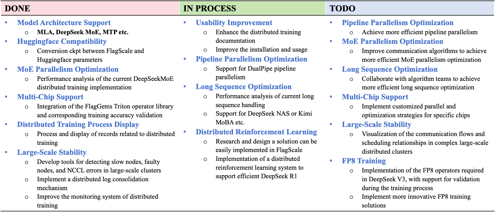

<div align="center">
  

</div>

<div align="center">

OpenSeek is dedicated to uniting the global open-source community to drive collaborative innovation in algorithms, data, and systems, with the goal of developing next-generation models that surpass DeepSeek.

English| [简体中文](README_zh.md)


[](https://github.com/FlagAI-Open/OpenSeek/blob/main/LICENSE)
[](https://github.com/FlagAI-Open/OpenSeek/stargazers)
[](https://github.com/FlagAI-Open/OpenSeek/network)
[](https://github.com/FlagAI-Open/OpenSeek/issues)

</div>

# 📌 Project Overview
OpenSeek is an open source project initiated by the Beijing Academy of Artificial Intelligence (BAAI), aiming to unite the global open source communities to drive collaborative innovation in algorithms, data and systems to develop next-generation models that surpass DeepSeek. Drawing inspiration from large model initiatives like Bigscience and OPT, the project is dedicated to building an independent open source algorithmic innovation system. Since the open sourcing of the DeepSeek model, academia has seen numerous algorithmic improvements and breakthroughs, but these innovations often lack complete code implementations, necessary computational resources, and high-quality data support. The OpenSeek project aims to explore high-quality dataset construction mechanisms through uniting the open source community, promote open sourcing of the entire large model training pipeline, build innovative training and inference code to support various AI chips besides Nvidia, and promote independent technological innovation and application development.

**Objectives of OpenSeek:**
- **Advanced data technology**: Address the challenge of acquiring high-quality data.
- **Multiple AI devices support**: Reduce dependency on specific chips and improve model universality and adaptability.
- **Standalised LLM training baseline**: Promote independent algorithmic innovation and technology sharing through open source collaboration.

**Project:** https://github.com/orgs/FlagAI-Open/projects/1 

**Acknowledgments & Contribution Guidelines**

Thanks to FlagScale team for their support for OpenSeek Training. 

- *For system-related improvements*
Please report framework-specific issues to [FlagScale's GitHub Issues](https://github.com/FlagOpen/FlagScale/issues). Code contributions should be submitted via Pull Requests (PRs) to the [FlagScale](https://github.com/FlagOpen/FlagScale).

- *For data & algorithm improvements*
Discussions of dataset implementations, training optimizations, and experimental configurations in [here](https://github.com/FlagAI-Open/OpenSeek/issues).

For detailed information on how to contribute, please refer to our [Contribution Guide](CONTRIBUTING.md). Feel free to contact us.  [[Discord channel](https://discord.gg/dPKWUC7ZP5)]
<div align="center">
  
</div>


# 📢 News
- 🔥[05/06/2025] **Data group**-release bilingual pretrainning dataset CCI4.0-M2-V1 <u>*[[readme](Docs/README_CCI4.0_M2_V1.md)]*</u>, **Algo group**-release the pretrained model OpenSeek-Small V1 <u>*[[readme](Docs/README_OPENSEEK_SMALL_V1.md)][[download](Docs/OpenSeek-Small_V1_download_link)]*.</u>
- 🔥[03/20/2025] #4 online meetup 19:00-20:00 :  [[screen recording]](https://meeting.tencent.com/crm/NL4rAjg489)
- 🔥[03/20/2025] #3 online meetup 19:00-20:00 ：[[screen recording]](https://meeting.tencent.com/crm/NXwDAyLG59)
- 🔥[03/06/2025] #2 online meetup 19:00-20:00 ：[[screen recording]](https://meeting.tencent.com/crm/2pxo8BBDb7)
- 🔥[02/25/2025] #1 online meetup 18:00-19:00 ：[[screen recording]](https://meeting.tencent.com/v2/cloud-record/share?id=e188482b-0105-43f9-b8e7-cf5f1e4d136b&from=3&is-single=false&record_type=2)
- 🔥[02/13/2025] Completed experiments on OpenSeek-PT-1T dataset, [more]().

# 🚗 Getting Started

## What is Baseline
The openseek-baseline is used as the baseline for [PAZHOU algorithm competition](https://www.aicompetition-pz.com/topic_detail/25) and also used to evaluate the PRs in openseek. Openseek-baseline is a standarlized LLM training and evaluating pipline, it consist of a [100B dataset](#Preparing-the-data), a [training code](#Running-the-Baseline), [wandb](https://wandb.ai/openseek-baai/OpenSeek-Small-v1-Baseline), [checkpoint](https://huggingface.co/BAAI/OpenSeek-Small-v1-Baseline) and [evaluation results](https://huggingface.co/BAAI/OpenSeek-Small-v1-Baseline#evalation). 

## Preparing Enviroment
1. Clone this repository and enter the directory:
```shell
git clone https://github.com/FlagAI-Open/OpenSeek.git
cd OpenSeek
```
2. Install the [FlagScale](https://github.com/FlagOpen/FlagScale) dependencies:
- Using Docker (Recommend)
```shell
# Pull images
docker pull openseek2025/openseek:flagscale-20250527

# Clone the repository
git clone https://github.com/FlagOpen/FlagScale.git
```

- From Source:
```shell
# Clone the repository
git clone https://github.com/FlagOpen/FlagScale.git

# Install the requirements
cd FlagScale/install
./install-requirements.sh --env train
```

- For more details, see [FlagScale](https://github.com/FlagOpen/FlagScale) or [readme](docs/FlagScale_Usage.md).

## Preparing the data
Download the [OpenSeek-Pretrain-100B](https://huggingface.co/datasets/BAAI/OpenSeek-Pretrain-100B) dataset to local dir named **OpenSeek-Pretrain-100B** in OpenSeek.

**You can also run the following script to build up your project environment after you have built python environment and activated it:**

```
bash openseek/baseline/setup.sh
```

## Running the Baseline
Make sure you have completed the environment installation and configuration as outlined in the [previous section](#preparation) and your **OpenSeek** folder should be like this:

```
OpenSeek
├── OpenSeek-Small-v1-Baseline (Experiment directory contains logs and model checkpoints.)
├── OpenSeek-Pretrain-100B (Dataset directory for downloaded datasets.)
├── FlagScale (FlagScale directory cloned from GitHub.)
├── ...
```

Next, you can run the baseline with a simple command:
```shell
bash openseek/baseline/run_exp.sh start
```

# 📚 Data Group
Target: We construct a large-scale multilingual pretraining dataset exceeding 10 trillion tokens, covering a diverse range of languages and domains. To further improve data quality and training efficiency, we incorporate data synthesis techniques, such as chain-of-thought generation and instruction tuning. 


## Stage1 results

[CCI4.0-M2 V1](docs/README_CCI4.0_M2_V1.md) is a large-scale bilingual pre-training dataset engineered for superior data quality and diverse human-like reasoning trajector:

|| CCI4.0-M2-Base v1 | CCI4.0-M2-CoT v1 |
|--|--|--|
|Download| [huggingface](https://huggingface.co/datasets/BAAI/CCI4.0-M2-Base-v1) | [huggingface](https://huggingface.co/datasets/BAAI/CCI4.0-M2-CoT-v1) |
|Notes| 5.2TB Chinese webpage, 22TB English webpage, some data released in [CCI4.0-M2-Extra](https://huggingface.co/datasets/BAAI/CCI4.0-M2-Extra-v1) due to the license concern. | 430 million CoT sample covers math, code, arxiv, wiki and webpage|


In addition to the main suite, [OpenSeek-Pretrain-100B](docs/100B_pipeline.md) was randomly sampled from the CCI4.0-M2 v1 datasets. This 100B data subset is specifically used for experimental training purposes.

Your can find more details about data [here](docs/README_CCI4.0_M2_V1.md).


# 🚀 Algorithm Group
Target: Our study focuses on three key aspects of large-scale language model training: data mixing, hyperparameter tuning, and reinforcement learning (RL). We systematically explore data composition strategies to balance quality and diversity across domains, investigate the impact of hyperparameter configurations on training stability and convergence, and incorporate RL-based optimization to further align model behavior with task-specific objectives. 

## Stage1 results
| | OpenSeek-Small-v1-Baseline | OpenSeek-Small-v1 |
|--|--|--|
|Parameter size| 1.4B (0.4B active) | 1.4B (0.4B active) |
|Number of tokens|100B|720B|
|Checkpoint|[huggingface](https://huggingface.co/BAAI/OpenSeek-Small-v1-Baseline)|[huggingface](https://huggingface.co/BAAI/OpenSeek-Small-v1)|
|Wandb|[wandb](https://wandb.ai/openseek-baai/OpenSeek-Small-v1-Baseline)|[wandb](https://wandb.ai/openseek-baai/OpenSeek-Small-v1)|
|Evaluation|[evaluation](https://huggingface.co/BAAI/OpenSeek-Small-v1-Baseline#evalation)|[evaluation](https://huggingface.co/BAAI/OpenSeek-Small-v1#benchmark-performance)|
|Experiment Config|[Experiment Config](configs/OpenSeek-Small-v1-Baseline/config_deepseek_v3_1_4b.yaml)|[Experiment Config](configs/OpenSeek-Small-v1/config_deepseek_v3_3b_1330B.yaml) |
|Training config| [Training Config](configs/OpenSeek-Small-v1-Baseline/train/train_deepseek_v3_1_4b.yaml)|[Training Config](configs/OpenSeek-Small-v1/train/train_deepseek_v3_3b_1330B.yaml)|
|Notes|This model is open-sourced as a baseline for future experiments in areas such as dataset construction, algorithmic strategies, and parallel training frameworks.|OpenSeek-Small v1 is the first-stage production model from the OpenSeek project, designed as a foundation for next-generation language models. |

> The usage and difference of Experiment Config and Training Config are explained [here](#experiment-configuration).

# 🖥️ System Group
Target：With support from the open-source community, flagscale aims to reproduce DeepSeek V3 & R1’s distributed training system, ensuring stable and performant end-to-end training.

## Stage1 results
<div align="center">
  
</div>

# Experiments & Advanced usage
## How to Train on Multiple Machines
- [distributed training](docs/distributed_training.md)
## How to do data mixture experiment
- [data mixture experiment](docs/data_mixture_exp.md)
## How to do algorithm experiment
- [algorithm experiment](docs/algorithm_exp.md)
## How to do system experiment
- [system experiment](docs/system_exp.md)

# 📜 License Agreement
- Apache 2.0

