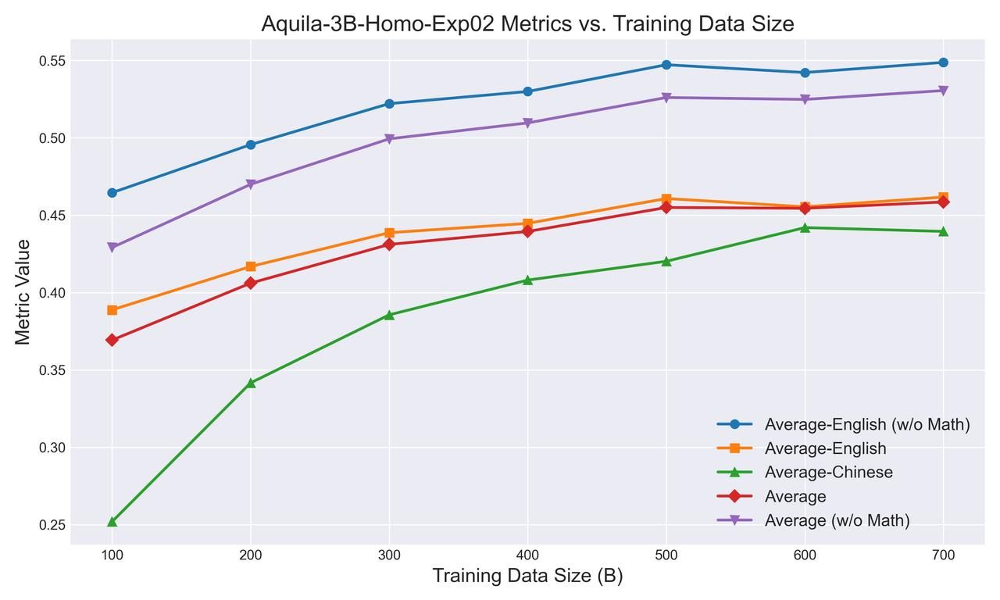

<div align="center">
  

</div>

<div align="center">

OpenSeek is dedicated to uniting the global open-source community to drive collaborative innovation in algorithms, data, and systems, with the goal of developing next-generation models that surpass DeepSeek.

English| [简体中文](README_zh.md)


[](https://github.com/FlagAI-Open/OpenSeek/blob/main/LICENSE)
[](https://github.com/FlagAI-Open/OpenSeek/stargazers)
[](https://github.com/FlagAI-Open/OpenSeek/network)
[](https://github.com/FlagAI-Open/OpenSeek/issues)

</div>

# 📌 Project Overview
OpenSeek is an open source project initiated by the Beijing Academy of Artificial Intelligence (BAAI), aiming to unite the global open source communities to drive collaborative innovation in algorithms, data and systems to develop next-generation models that surpass DeepSeek. Drawing inspiration from large model initiatives like Bigscience and OPT, the project is dedicated to building an independent open source algorithmic innovation system. Since the open sourcing of the DeepSeek model, academia has seen numerous algorithmic improvements and breakthroughs, but these innovations often lack complete code implementations, necessary computational resources, and high-quality data support. The OpenSeek project hopes to explore high-quality dataset construction mechanisms through uniting the open source community, promote open sourcing of the entire large model training pipeline, build innovative training and inference code to support various AI chips besides Nvidia, and promote independent technological innovation and application development.

**Objectives of OpenSeek:**
- Innovative data synthesis technology: Address the challenge of acquiring high-quality data and break through data barriers.
- Support for multiple AI chips: Reduce dependency on specific chips and improve model universality and adaptability.
- Build an independent open source algorithmic innovation system: Promote independent algorithmic innovation and technology sharing through open source collaboration.

**Project:** https://github.com/orgs/FlagAI-Open/projects/1 

**Acknowledgments & Contribution Guidelines**

We extend our sincere gratitude to the FlagScale team for their foundational framework support. This project is built upon FlagScale's robust infrastructure.

- *For framework-related discussions/issues*
Please direct your questions and report framework-specific issues through FlagScale's GitHub Issues. Code contributions should be submitted via Pull Requests (PRs) to the FlagScale repository.

- *For data strategies & training methodologies*
Discussions, proposals, and PRs regarding dataset implementations, training optimizations, and experimental configurations should be initiated through this project's GitHub Issues and Pull Requests.


# 📢 News
- 🔥[03/06/2025] #2 online meetup 19:00-20:00 ：https://meeting.tencent.com/crm/2pxo8BBDb7
- 🔥[02/25/2025] #1 online meetup 18:00-19:00 ：https://meeting.tencent.com/v2/cloud-record/share?id=e188482b-0105-43f9-b8e7-cf5f1e4d136b&from=3&is-single=false&record_type=2
- 🔥[02/13/2025] Completed validation of the OpenSeek-PT-1T dataset on a 3B size model, released model checkpoints, data ratios, training codes with hyperparameters, and wandb logs.

# Getting Started
## Installation
```
git clone https://github.com/FlagAI-Open/OpenSeek.git
cd OpenSeek
cd flagscale/install
./install-requirements.sh --env train
```
The above instructions create conda environments: `flagscale-train`, which contain the dependency environments for training.


# 🚀 Training


## Phase 1: Training

| Category | Data | ckpt | Evaluation Results | Training Hyperparameters | Wandb | Discussion |
|----------|------|------|--------------------|--------------------------|-------|------------|
| Content  | Aquila-3B data validation model<br>OpenSeek-PT-1.3T v0.1 | -- | <br> | seqlen: 4096<br>gbs: 8M<br>lr: 3.0e-3<br>lr_decay_style: WSD | <br>https://wandb.ai/aquila3/OpenSeek-3B-v0.1/runs/aquila_3b_exp02-rank-63 | -- |


# 👁 Project Highlights
- *High-Quality Data Accessibility:*
Open-source 10TB-level, high-quality Chinese and English pretraining data, ensuring robust and diverse model training resources.
- *Scalable Data Synthesis Strategy:*
A streamlined and scalable approach to synthesizing Chain-of-Thought (CoT) data, leveraging Webpage, Code, Math, Wiki, and Book sources to enhance reasoning capabilities.
- *Multi-AI Chip Support:*
  Built on Triton, the project offers optimized support for multiple AI chips, ensuring flexibility and adaptability across diverse hardware ecosystems.
- *High-Performance Training Infrastructure:*
  Highly optimized training support, designed to maximize efficiency and accelerate model development.
- *Advanced Model Architecture:*
  A more efficient model structure, optimized for performance and scalability, enabling superior computational efficiency and inference speed.


# ☎️ Open-Source Co-construction Plan
OpenSeek thrives on community collaboration. We believe in the collective intelligence of developers worldwide and welcome contributions that advance this project toward excellence.

For detailed information on how to contribute, please refer to our [Contribution Guide](CONTRIBUTING.md).

Together, we can explore the frontiers of large language models and drive technological innovation through open source collaboration.

<div align="center">
  
</div>


# ⏰ RoadMap
## ✅ Phase 1: Complete OpenSeek-data-1.3TB Creation & OpenSeek-Small Distributed Training 
### 📊 Data
- [x] Build data processing and synthesis pipeline
- [x] Build OpenSeek-PTx1.3T-v0.1
- [x] Construct OpenSeek-data-1.3T official version based on OpenSeek-Small data ratio experiments

### 🔄 Training
- [x] Validate 3B model effects on OpenSeek-PT-1.3T-v0.1 (Baseline)
- [x] Complete experimental training of OpenSeek-Small (~100B)

### 💻 System
- [x] Support distributed training for MLA, DeepSeek MoE, MTP, Auxiliary-Loss-Free etc.
- [x] Convert and load DeepSeek V3 parameters

## ⚡ Phase 2: Expand Data Scale & Optimize Distributed Training Performance
### 📊 Data
- [x] Expand data scale, build OpenSeek-PT-8T
- [x] Construct Long-CoT-Backward synthetic dataset and verify effects

### 🔄 Training
- [ ] ⚡ Complete hyperparameter experiments for OpenSeek-Small
- [ ] ⚡ Validate OpenSeek-PT-8T effects
- [ ] ⚡ Complete full training of OpenSeek-Small on OpenSeek-PT-1.3T-v1.0

### 💻 System
- [ ] ⚡ Support Node-limited Routing MoE
- [ ] ⚡ Support FP8 distributed training
- [ ] ⚡ Integrate Triton-based operator library FlagGems

## Phase 3: Support Larger Scale Data & Distributed Training
### 📊 Data
- [ ] Build OpenSeek-Zero dataset
- [ ] Build OpenSeek-RL dataset
- [ ] Build OpenSeek-SFT dataset
- [ ] Construct Long-CoT-Forward synthetic dataset and verify effects

### 🔄 Training
- [ ] Produce OpenSeek-Small-Zero
- [ ] Produce OpenSeek-Small-SFT
- [ ] Produce OpenSeek-Small-RL
- [ ] Complete hyperparameter experiments for OpenSeek-Mid
- [ ] Complete full training of OpenSeek-Mid on OpenSeek-PT-8T

### 💻 System
- [ ] Support DualPipe pipeline parallelism
- [ ] Further optimize computation-communication overlap and memory optimization

## Phase 4: Upgrade Multi-chip Support & Open Source Release
### 📊 Data
- [ ] Release official version of OpenSeek series datasets
- [ ] Construct Long-CoT-RAG synthetic dataset and verify effects

### 🔄 Training
- [ ] Produce OpenSeek-Mid-Zero
- [ ] Produce OpenSeek-Mid-SFT
- [ ] Produce OpenSeek-Mid-RL

### 💻 System
- [ ] Adapt training and precision alignment for different chips
- [ ] Implement customized parallel and optimization strategies for specific chips


# 📜 License Agreement
- Code is licensed under Apache 2.0
- Model weights are licensed under Apache 2.0
- Data is licensed under CC BY-SA 4.0

**Note**: Full reproduction requires at least 8 H100 GPUs, and it is recommended to use the SLURM cluster management system. Datasets need to be applied for or generated independently, and some sensitive data is not included in the open source package.


