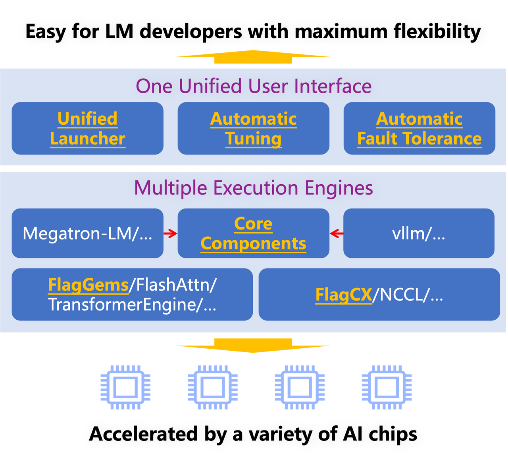

  

OpenSeek aims to unite the global open source community to drive collaborative innovation in algorithms, data and systems to develop next-generation models that surpass DeepSeek.
English| [简体中文](README_zh.md)

# 📌 Project Overview
OpenSeek is an open source project initiated by the Beijing Academy of Artificial Intelligence (BAAI), aiming to unite the global open source communities to drive collaborative innovation in algorithms, data and systems to develop next-generation models that surpass DeepSeek. Drawing inspiration from large model initiatives like Bigscience and OPT, the project is dedicated to building an independent open source algorithmic innovation system. Since the open sourcing of the DeepSeek model, academia has seen numerous algorithmic improvements and breakthroughs, but these innovations often lack complete code implementations, necessary computational resources, and high-quality data support. The OpenSeek project hopes to explore high-quality dataset construction mechanisms through uniting the open source community, promote open sourcing of the entire large model training pipeline, build innovative training and inference code to support various AI chips besides Nvidia, and promote independent technological innovation and application development.

**Core Objectives of OpenSeek:**
- Innovative data synthesis technology: Address the challenge of acquiring high-quality data and break through data barriers.
- Support for multiple AI chips: Reduce dependency on specific chips and improve model universality and adaptability.
- Build an independent open source algorithmic innovation system: Promote independent algorithmic innovation and technology sharing through open source collaboration.

**Project Repository:** https://github.com/FlagAI-Open/OpenSeek

# 📢 News
- 🔥[02/25/2025] #1 online meetup 18:00-19:00 ：https://meeting.tencent.com/v2/cloud-record/share?id=e188482b-0105-43f9-b8e7-cf5f1e4d136b&from=3&is-single=false&record_type=2
- 🔥[02/13/2025] Completed validation of the OpenSeek-PT-1T dataset on a 3B size model, released model checkpoints, data ratios, training codes with hyperparameters, and wandb logs.

# 👁 Project Highlights
 - High-quality data open and accessible
  - Open source large-scale high-quality Chinese and English datasets (>4TB), covering a wide variety of data types and scenarios.
  - Open source high-quality dataset construction plans, supporting diverse high-quality data synthesis based on human data, helping developers achieve innovation at the data level.
- Multi-AI chip distributed training framework
  - Support for Triton operators, multi-chip training, compatible with various hardware architectures, ensuring efficient utilization of different devices.
  - Implement more efficient computation, communication, and memory access collaborative hybrid parallel schemes, providing cluster training logs and performance data to help developers optimize large-scale training tasks.
- Model structure optimization and improvement
  - Explore optimization of two different model sizes, OpenSeek-small and OpenSeek-Mid, to meet the needs of different application scenarios.
  - Provide training experiences and optimization plans for small-sized models to help developers achieve high-performance development and deployment in resource-constrained environments.

# ☎️ Open Source Co-construction Plan
As a member of the open source community, we deeply understand that the power of open source comes from the wisdom and enthusiasm of every developer. We firmly believe that through the joint efforts of global developers, every contribution will push the project towards maturity and perfection.

Welcome to check our [Contribution Guide](CONTRIBUTING.md) for more details.

Whether you are:
- A deep learning expert with experience in large model training;
- A data scientist dedicated to data construction and algorithm innovation;
- Or a beginner passionate about open source projects;

You can find a platform to showcase your talents at OpenSeek. You can contribute in the following ways:
- Code and technical solution contributions
  - If you have unique insights into training processes, code implementation, or performance optimization, feel free to submit a Pull Request and help us advance the project.
- Data, algorithm, and resource support
  - If you have high-quality datasets, innovative algorithms, or other valuable resources and wish to contribute in non-code forms, please contact us directly to discuss collaboration methods.
- Participate in technical discussions and documentation improvement
  - Share your insights, experiences, and suggestions to help us continuously improve project documentation and technical details.
- Synthetic Reasoning Data Co-construction Plan
  - We will update the [Huggingface](https://huggingface.co/datasets/BAAI/OpenSeek-Synthetic-Reasoning-Data-Examples) platform with sample data, effects, and strategies used for each version of our synthesized samples (if the strategies provided by external contributors we will cite thanks to involved team or individual). Currently recommended optimization directions for reasoning data synthesis include:
    - Building a domain labeling system to balance data diversity:
      - Labeling system in Code Domain
      - Labeling system in Math Domain
      - Labeling system in Paper (Arxiv) Domain
      - Labeling system in Wiki Domain
      - Labeling system in Webpage Domain
    - Synthetic data quality evaluation and screening:
      - Synthetic Data Quality Evaluation and Screening in Code Domain
      - Synthetic Data Quality Assessment and Screening in Math Damain
      - Synthetic Data Quality Assessment and Screening in Paper (Arxiv) Domain
      - Synthetic Data Quality Assessment and Screening in Wiki Domain
      - Synthetic Data Quality Assessment and Screening in Webpage Domain
    - Synthesis pipeline optimization:
      - Synthesis Pipeline Optimization in Code Domain
      - Synthetic Pipeline Optimization in Math Domain
      - Synthesis Pipeline Optimization for the Paper (Arxiv) Domain
      - Synthetic Pipeline Optimization for the Wiki Domain
      - Synthesis Pipeline Optimization for the Webpage Domain

Let's explore the infinite possibilities of large model training with the power of open source and promote continuous technological progress!

  

# ⏰ RoadMap
| Direction | One: Complete the creation of OpenSeek-data-1.3TB, support OpenSeek-Small distributed training | Two: Expand data scale and optimize distributed training performance, complete OpenSeek-small training on the final version of OpenSeek-PT-1.3T data | Three: Support larger scale data and distributed training, complete OpenSeek-Mid training on OpenSeek-PT-8T data, achieve full process training support | Four: Upgrade multi-chip support, open source datasets and model weights |
|-----------|------------------------------------------------------------|-----------------------------------------------------------------|-----------------------------------------------------------------|-------------------------------------------------------------|
| Data      | ☐ Build data processing + data synthesis pipeline ☐ Build OpenSeek-PT-1.3T-v0.1 ☐ Construct OpenSeek-data-1.3T official version based on OpenSeek-Small data ratio experiment results | ☐ Expand data scale, build OpenSeek-PT-8T ☐ Construct Long-CoT-Backward synthetic dataset and verify effects | ☐ Build OpenSeek-Zero dataset ☐ Build OpenSeek-RL dataset ☐ Build OpenSeek-SFT dataset ☐ Construct Long-CoT-Forward synthetic dataset and verify effects | ☐ Release official version of OpenSeek series datasets ☐ Construct Long-CoT-RAG synthetic dataset and verify effects |
| Training  | ☐ Validate 3B model effects on OpenSeek-PT-1.3T-v0.1 (Baseline) ☐ Complete experimental training of OpenSeek-Small (~100B) | ☐ Complete hyperparameter experiments for OpenSeek-Small ☐ Validate OpenSeek-PT-4T effects ☐ Complete full training of OpenSeek-Small on OpenSeek-PT-1.3T-v1.0 | ☐ Produce OpenSeek-Small-Zero ☐ Produce OpenSeek-Small-SFT ☐ Produce OpenSeek-Small-RL ☐ Complete hyperparameter experiments for OpenSeek-Mid ☐ Validate OpenSeek-PT-8T effects ☐ Complete full training of OpenSeek-Mid on OpenSeek-PT-8T | ☐ Produce OpenSeek-Mid-Zero ☐ Produce OpenSeek-Mid-SFT ☐ Produce OpenSeek-Mid-RL |
| System    | ☐ Support the distributed training for MLA, DeepSeek MoE, MTP, Auxiliary-Loss-Free etc.  ☐ Convert and load DeepSeek V3 parameters | ☐ Support Node-limited Routing MoE ☐ Support FP8 distributed training ☐ Integrate Triton-based operator library FlagGems | ☐ Support DualPipe pipeline parallelism ☐ Further optimize computation-communication overlap and memory optimization | ☐ Adapt training and precision alignment for different chips ☐ Implement customized parallel and optimization strategies for specific chips |

# 📚 Data

## 1. Data Source Preparation
The pre-training dataset is mainly composed of collected and selected open source datasets.

### English Common Crawl
- https://data.commoncrawl.org/contrib/Nemotron/Nemotron-CC/index.html
- https://huggingface.co/datasets/HuggingFaceFW/fineweb-edu

### Chinese Common Crawl
- https://huggingface.co/datasets/BAAI/CCI3-HQ
- https://huggingface.co/datasets/opencsg/Fineweb-Edu-Chinese-V2.1

### Other Domains
#### Wiki & Books & Arixv
- English: https://huggingface.co/datasets/allenai/dolma
- Chinese: Self-built Chinese encyclopedia, books, and literature data

#### Math
- https://huggingface.co/datasets/OpenCoder-LLM/opc-fineweb-math-corpus
- https://huggingface.co/datasets/EleutherAI/proof-pile-2
- https://huggingface.co/datasets/HuggingFaceTB/finemath

#### Code
- https://huggingface.co/datasets/OpenCoder-LLM/opc-fineweb-code-corpus
- https://huggingface.co/datasets/HuggingFaceTB/smollm-corpus
- https://huggingface.co/datasets/bigcode/the-stack-v2

## 2. Data Synthesis
- **Preliminary Reasoning Data Synthesis**: semantically segment, summarize, organize CoT process, and summarize queries on the original pre-trained documents. take {Query, CoT process, Original document} as one training sample.
- **Labeling system construction**: build labeling system by domain (code, math, general knowledge, etc.) to balance data diversity.
- **Synthesized Data Quality Evaluation and Filtering**: Evaluate the quality of synthesized data based on rules, models, etc., and screen out low-quality data.
- **Synthesis Pipeline Optimization**: Optimize the existing synthesis prompt or synthesis pipeline, re-synthesize based on the first version of reasoning data, etc. to increase the quality of reasoning data.

## 3. Data Preprocessing

### Deduplication
- **Global Fuzzy Deduplication Based on MiniHash**
  - https://github.com/huggingface/datatrove/blob/main/examples/minhash_deduplication.py
- **Exact Substring Deduplication**
  - https://github.com/google-research/deduplicate-text-datasets

### Rule-based Filtering
Developed based on the data-juicer tool https://github.com/modelscope/data-juicer, the main rules include:
- Document character length
- Average sentence character length in documents
- Traditional Chinese to Simplified Chinese conversion
- Sensitive word and safety word filtering

### Quality Classifier
- Chinese quality classifier based on education level estimation
- English quality classifier based on multiple education level estimations

# 🖥️ System

This project uses [FlagScale](https://github.com/FlagOpen/FlagScale.git) as the distributed training framework. This framework is an end-to-end framework for large models across multiple chips, built entirely on open source technology by the Beijing Academy of Artificial Intelligence (BAAI) in collaboration with ecosystem partners, maximizing computational resource efficiency while ensuring model effectiveness.

  

The FlagScale architecture can be divided into three layers:

1. **Frontend**: Provides a unified user interface and automation tools, such as a unified launcher and auto-tuning, for a good user experience.

2. **Middleware**: Includes multiple high-performance execution engines, both self-developed and open source, covering training, compression, inference, and service stages, enhancing system flexibility and scalability.

3. **Backend**: Contains underlying operator libraries and communication libraries to ensure efficient and reliable performance, especially the Triton-based operator library [FlagGems](https://github.com/FlagOpen/FlagGems) and unified heterogeneous communication library [FlagCX](https://github.com/FlagOpen/FlagCX), enabling computation and communication across different chips.

This project will utilize the FlagScale framework and leverage the power of the open source community to produce the distributed training system technology of DeepSeek V3 & R1, striving to ensure the stability and practical effectiveness of the system in the end-to-end training process. On this basis, we hope to further explore the collaborative optimization of model algorithms and system efficiency, including:
- **Model Structure Improvement**: Further improve MLA, MTP, and MoE, etc. to optimize performance and training efficiency .
- **Computation and Communication Scheduling Optimization**: Develop general computation and communication scheduling technologies suitable for more chips, enhancing cross-hardware platform compatibility and computational efficiency.
- **Low Precision Training Optimization**: Explore more stable training schemes for low precision numerical formats like FP8 and develop corresponding operator optimizations to reduce computational costs and improve training stability.

Through these technological innovations, we hope to promote the efficiency, compatibility, and scalability of distributed training systems, providing stronger support for large-scale AI training.

# 🚀 Training

## Phase 1: V3 Pre-training

| Category | Data | ckpt | Evaluation Results | Training Hyperparameters | Wandb | Discussion |
|----------|------|------|--------------------|--------------------------|-------|------------|
| Content  | Aquila-3B data validation model OpenSeek-PT-1.3T v0.1 | -- |   | seqlen: 4096 gbs: 8M lr: 3.0e-3 lr_decay_style: WSD |  https://wandb.ai/aquila3/OpenSeek-3B-v0.1/runs/aquila_3b_exp02-rank-63 | -- |

# 📜 License Agreement
- Code is licensed under Apache 2.0
- Model weights are licensed under Apache 2.0
- Data is licensed under CC BY-SA 4.0

**Note**: Full reproduction requires at least 8 H100 GPUs, and it is recommended to use the SLURM cluster management system. Datasets need to be applied for or generated independently, and some sensitive data is not included in the open source package.

